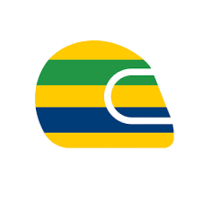
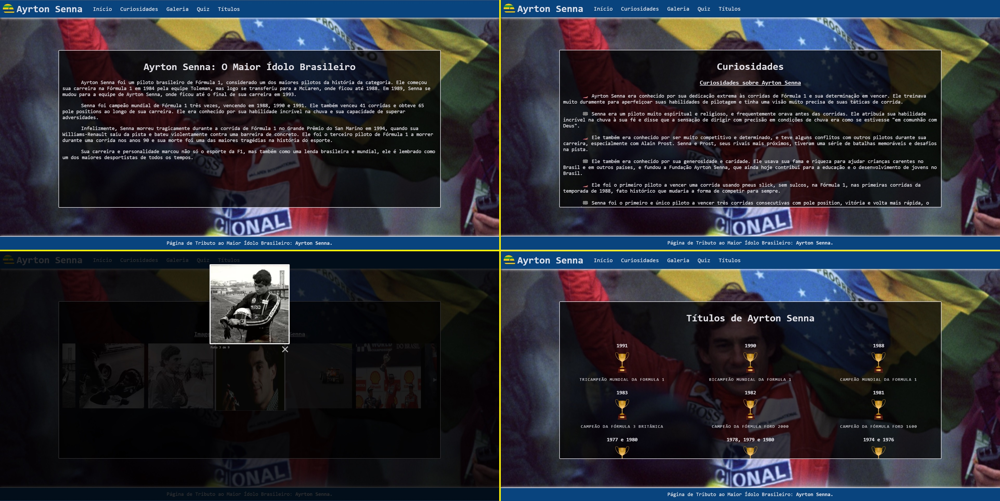
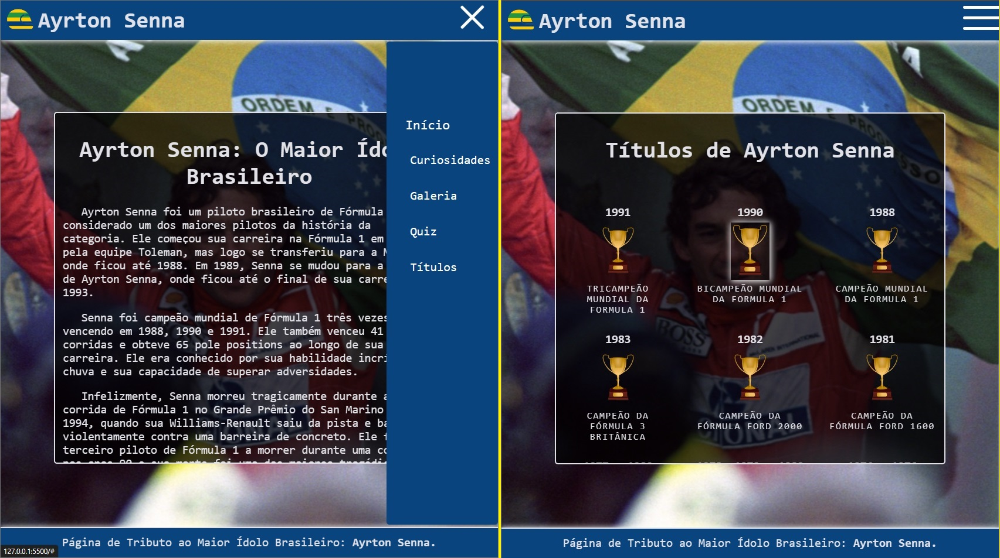

 
 

# Website/Tributo: Ayrton Senna  - O Maior Ídolo Brasileiro

Projeto pessoal homenageando o piloto de Fórmula 1 brasileiro, Ayrton Senna.
 
 

## Tecnologias Utilizadas

 
 

## Aplicado

* 🖍️ Armazenamento das cores utilizadas no projeto em variáveis CSS;
* 🍔 Menu hamburguer animado, totalmente em CSS;
* 🖼️ Galeria de Fotos Carrossel;
* 🏆 Linha do Tempo de Premiações do homenageado.
 
 

## Em Andamento

* ⏳ Preenchimento das Informações do Site (80%);
* ⏳ Quiz em JavaScript e API JSON;
 
 

## Screenshots

 
 

 
 

## Visite o Projeto

 
 
 
 

